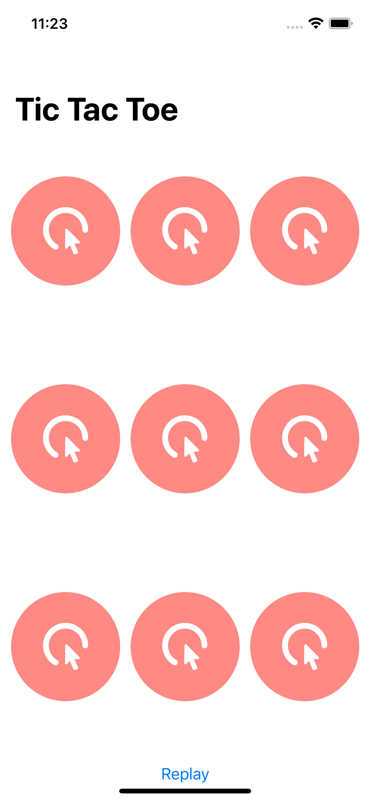

# 1 Player Tic-Tac-Toe Game
SwiftUI, a 1-player tic-tac-toe game follow the courses by [Sean Allen](https://seanallen.teachable.com/).

# Menu
* [Screenshots](#screenshots)
* [Features](#features)
* [To-Do](#to-do)
* [Source](#source)
* [Contributions](#contributions)
* [Contact](#contact)

# Screenshots

# Features

* Computer played itself

### To-Do

* Computer difficulty level customizable
* Add multi-player function

# Source
This game follow the tutorial by [Sean Allen](https://seanallen.teachable.com/), fully developed with SwiftUI.

# Contributions

* All kinds of contributions (enhancements, new features, documentation & code improvements, issues & bugs reporting & todo task) are welcome. Let's make it better.

# Contact
Created by [Terry Kuo](https://twitter.com/ArgonYoYo) - feel free to contact me!
